<picture>
  <source media="(prefers-color-scheme: dark)" srcset="./assets/header-dark.svg">
  
</picture>

&nbsp;

## §&nbsp;01&nbsp;&nbsp;·&nbsp;&nbsp;Brief

I work where rigorous mathematical control theory meets real-world AI deployment — from **marine-renewable offshore datacenters** to **agentic LLM systems** that reason, negotiate, and act autonomously. Research Scientist at **Tsinghua University (SIGS, Shenzhen)**, Chief Data Scientist at **CyberGen Inc.**, and Co-founder & CAIO of **Qubit Dynamics**. 30+ SCI publications, h-index 17, 1,000+ citations.

> **I don't just study AI — I build it, deploy it, teach it, and publish it.**

&nbsp;

<picture>
  <source media="(prefers-color-scheme: dark)" srcset="./assets/research-domains-dark.svg">
  
</picture>

&nbsp;

## §&nbsp;03&nbsp;&nbsp;·&nbsp;&nbsp;Tech Stack

<picture>
  <source media="(prefers-color-scheme: dark)" srcset="./assets/stack-dark.svg">
  
</picture>

&nbsp;

## §&nbsp;04&nbsp;&nbsp;·&nbsp;&nbsp;Publications

<table width="100%">
  <tr>
    <td align="center" width="25%">
      <sub><b>SCI PAPERS</b></sub><br/>
      <span style="font-size:32px"><b>30+</b></span>
    </td>
    <td align="center" width="25%">
      <sub><b>H-INDEX</b></sub><br/>
      <span style="font-size:32px"><b>17</b></span>
    </td>
    <td align="center" width="25%">
      <sub><b>CITATIONS</b></sub><br/>
      <span style="font-size:32px"><b>1,000+</b></span>
    </td>
    <td align="center" width="25%">
      <sub><b>STARTUPS</b></sub><br/>
      <span style="font-size:32px"><b>3</b></span>
    </td>
  </tr>
</table>

**Journals.** *Energy* · *Applied Energy* · *CSEE Journal of Power and Energy Systems* · *Journal of Energy Storage* · *IEEE Transactions* (various).

**Active research themes.**
- Three-layer hierarchical control (**MILP + LP + NSFTSMC**) for offshore AI datacenters
- **LLM-based multi-agent** energy negotiation
- Nonlinear robust control for DC microgrids under stochastic disturbances
- **Agentic AI** resilience modeling

**Key collaborators.** Dr. Xinwei Shen (Tsinghua University) · Dr. Hammad Armghan · CyberGen Research Group · Qubit Dynamics AI Lab.

&nbsp;

<picture>
  <source media="(prefers-color-scheme: dark)" srcset="./assets/affiliations-dark.svg">
  
</picture>

&nbsp;

## §&nbsp;06&nbsp;&nbsp;·&nbsp;&nbsp;White Papers

<table width="100%">
  <tr>
    <td valign="top" width="50%">
      <sub><b>CYBERGEN  ·  AI × ENERGY  ·  3 VOL.</b></sub>
      <ul>
        <li><b>Vol. 1</b> — Autonomous AI Grids</li>
        <li><b>Vol. 2</b> — Offshore AI Compute</li>
        <li><b>Vol. 3</b> — Agentic AI Resilience</li>
      </ul>
    </td>
    <td valign="top" width="50%">
      <sub><b>EXECUTIVE  ·  STRATEGIC  ·  APPLIED</b></sub>
      <ul>
        <li>AI for Leadership — 5-Day Executive Course</li>
        <li>AI Readiness Framework for Enterprise</li>
        <li>Digital Twins for Industrial Infrastructure</li>
        <li>AI Bus Routing &amp; Fleet Intelligence</li>
      </ul>
    </td>
  </tr>
</table>

&nbsp;

## §&nbsp;07&nbsp;&nbsp;·&nbsp;&nbsp;Impact

<table width="100%">
  <tr>
    <td valign="top" width="25%"><sub><b>🇨🇳 &nbsp; CHINA</b></sub><br/>Leading AI research at one of the world's top universities.</td>
    <td valign="top" width="25%"><sub><b>🇵🇰 &nbsp; PAKISTAN</b></sub><br/>Building the local AI ecosystem via Qubit Dynamics and CyberGen Academy.</td>
    <td valign="top" width="25%"><sub><b>🇺🇸 &nbsp; UNITED STATES</b></sub><br/>Teaching applied AI at Indian River State College, Florida.</td>
    <td valign="top" width="25%"><sub><b>🌐 &nbsp; ADVISORY</b></sub><br/>AI strategy for government, energy, and transport across MENA &amp; South Asia.</td>
  </tr>
</table>

&nbsp;

## §&nbsp;08&nbsp;&nbsp;·&nbsp;&nbsp;Connect

```
linkedin         linkedin.com/in/naghmash
google scholar   scholar.google.com
researchgate     researchgate.net
mail             naghmash@cybergen.ai
github           github.com/naghmash1
```

---

<div align="center">
  <br/>
  <i><b>Building AI systems that think, adapt, and endure.</b></i><br/>
  <sub>Last edited by hand, not by autogen.</sub>
</div>
