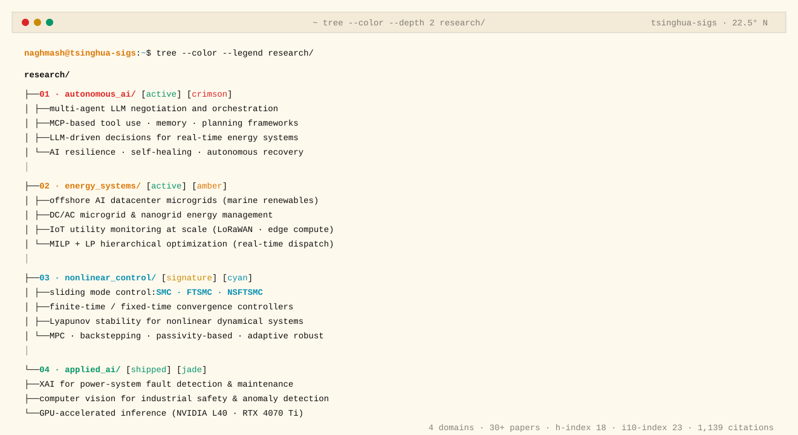
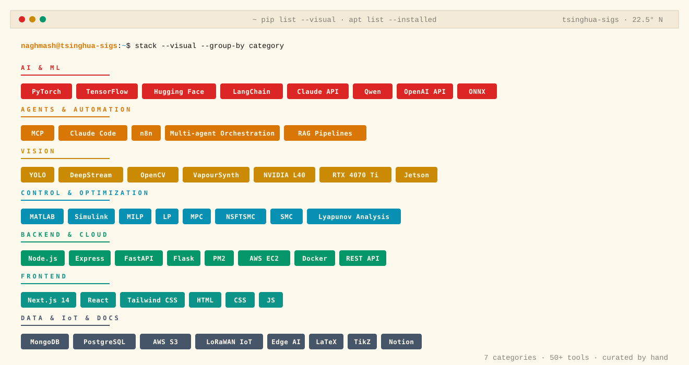

<picture>
  <source media="(prefers-color-scheme: dark)" srcset="./assets/header-dark.svg">
  
</picture>

&nbsp;

> ```diff
> + I don't just study AI — I build it, deploy it, teach it, and publish it.
> ```

&nbsp;

## `$ tree research/`

<picture>
  <source media="(prefers-color-scheme: dark)" srcset="./assets/research-domains-dark.svg">
  
</picture>

&nbsp;

## `$ stack --visual`

<picture>
  <source media="(prefers-color-scheme: dark)" srcset="./assets/stack-dark.svg">
  
</picture>

&nbsp;

## `$ papers --stats --recent`

```bash
naghmash@tsinghua-sigs:~$ papers --stats

┌───────────────────┬──────────┐
│ sci publications  │  30+     │
│ h-index           │  17      │
│ citations         │  1,000+  │
│ startups          │  3       │
└───────────────────┴──────────┘

journals
  ▸ Energy
  ▸ Applied Energy
  ▸ CSEE Journal of Power and Energy Systems
  ▸ Journal of Energy Storage
  ▸ IEEE Transactions (various)

active research themes
  ▸ three-layer hierarchical control (MILP + LP + NSFTSMC)
    for offshore AI datacenters                              [signature]
  ▸ LLM-based multi-agent energy negotiation                 [active]
  ▸ nonlinear robust control for DC microgrids
    under stochastic disturbances                            [active]
  ▸ agentic AI resilience modeling                           [active]

collaborators
  ▸ Dr. Xinwei Shen (Tsinghua University)
  ▸ Dr. Hammad Armghan
  ▸ CyberGen Research Group
  ▸ Qubit Dynamics AI Lab
```

&nbsp;

## `$ cat ~/.contact`

```bash
naghmash@tsinghua-sigs:~$ cat ~/.contact

mail            naghmash@cybergen.ai
linkedin        linkedin.com/in/naghmash
google scholar  scholar.google.com
researchgate    researchgate.net
github          github.com/naghmash1
```

&nbsp;

## `$ exit`

```bash
naghmash@tsinghua-sigs:~$ exit

# building AI systems that think, adapt, and endure.
# last edited by hand, not by autogen.

Connection to tsinghua-sigs closed.
```
